# 输油管道
+ 这道题没有给出精度说明，显然不同精度下最优解是不同的，不过实际工程实践中怕是也不会将这个距离算至小数点，我们考虑纯整数情况：最小距离即y轴距离之和的最小值
$min|y_i-y|$,这个输油管道首先肯定在$y$轴最大最小值之间，给这$n$口油井排序的话，如果油井是偶数，主管道显然要在油井中间即最终南北方向各n/2口井水，如果n为奇数，主管道就在第$n/2+1$的位置上，显然这道题变成了求中位数，要求线性时间我们排除排序法那么就是BFPRT算法了，（也称SELECT算法）最坏的情况下复杂度$O(n)$
算法原理BFPRT：实际上忽视两个方法出现的早晚问题，BFRPT可以看成是改进的快排+二分，他有一个有意思的一点就是找中位数时的5个一组，5个一组对于查找中位数来说非常有利，利用插入排序的方式也非常适合小规模（如5）的排序问题，效率跟得上，另一个重要思想是找中位数的中位数，可以快速确定一个基准值，这就是用来改进快排时基准值的参照问题，极大改善最坏情况下复杂度问题，剩下的递归思想就比较简单，像二分一样，要么在左边递归要么在右边递归
复杂度分析：看代码不易看出，但根据算法的原理可得到复杂度方程即$T(n)<=T(n/5)+T(7n/10+6)+c*n$其中$C*n$是当前操作中包括n/5个5插入排序花费的时间（这一点就可以看到选取5的作用能保证n的系数为一个常数而不是n或其他！）以及利用快排思想的一次划分的$n$,$T(n/5)$为中位数的中位数,$T(7n/10)$是递归调用中下一次划分边界最多为$7n/10$，因为前一步找到的中位数的中尉数一定在$3n/10$的位置之后，这里看图更好理解

可以看到10小块中$mid$要一定大于其中的三块,实际上是有一半的数组中有3个以上不大于$mid$，这要减去$mid$所在和最后不能整除5的多余组即$3*\frac{1*n}{2*5}-2$即$3n/10-6$，对应最大划分即为$7n/10+6$下面证明$T(n)$
这里将$c*n$暂时作为$O(n)$，引入另一常量$c和m$
假设对$n<m$有$T(n)<cn$根据上述复杂度方程,这个假设是成立的，另有$O(n) < an$其中$a$为常数，则有$T(n)<=m[n/5]+m(7n/10+6)+an<=mn/5+m+7mn/10+6m+an<=mn+(7m-mn/10)+an$对$n>m$的情况有$n/(n-c)<=2$则$m>=20a$就满足情况所以说$T(n)<=20an$即$T(n)=O(n)$
- - -
# 扫雷
+ 这道题根据给出的图可以看出一个格子可能是1-8代表周围有1-8颗雷，也有可能是雷，或者是空格，这一共是10种情况，但由于我们知道每个格子的数值及表示1-8的格子，剩下的就是未知情况，也就是说这里需要把一切未知写成9，它可能是空的，也可能有雷。，所以我们每次就要围绕这个9处理，写有1-8的格子肯定是无雷的。
+ 根据这道题的描述，数字代表它本身和周围一共9个格子，如果是9这个位置必有雷，所以说这道题我们实际输入的数据图并不是游戏中所示如果是8那它周围8个雷。乍一看不好想到动态规划递归什么的解法），但是我们发现另一个思路，比如说如果当前为$3×3$那么根据题意直接的中间的数即为解，如果$9×9$9个中间的即为解，画图看一下
如图$3×3$解为中间对号的数，$9×9$解为$9$个$3×3$中间的数,那么这种$Pmod3 = 0$的情况考虑过了$P!=3$的情况呢？其实也好办$Pmod3$无非为0、1、2为1时好像不容易想，我们看为2时，为2时我们发现对边界两排来说中间的数仍为正确的解$2×2$和$2×3$同样也是一个好例子，画图示例如下两图
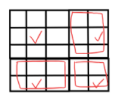
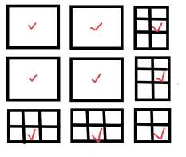
5×5及8×8为例，解都为对号所处数字之和，也即处在边界的仍在中心位置，角上的四个数量为顶角的值。
我们看到$Pmod3=2$时及$2×2$和$2×3$仍可利用这个原理解得
现在只剩下$Pmod3=1$的情况，由于有$1+2=3$及$(2+2)mod3=1$想到我们可以把$mod1$分成$2+2$的情况。画图举个例子证明
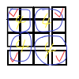
这个例子中$4×4$被拆成了四个$2×2$解为四个角对号已经勾示出来，这个情况比较特殊，但不难推出一般情况，每次加对$Pmod3=1$的情况每次$P+3$的新的图其实是往这四个格子中填充$3×3$和$2×3$的矩阵，画图示例.
实际写代码的时候发现，对于$Pmod3=0和Pmod3=1$的情况来说代码一样，观察图形不难发现实际上$Pmod3=1$的边界仍为内部边缘$+3$，而对于$Pmod3=2$,也只不过是开始的值不同不是由a[1][1]开始，而是由a[0][0]开始，之后仍一直加3即可。此题显而易见时间复杂度为$O(n^2)$
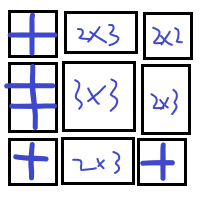
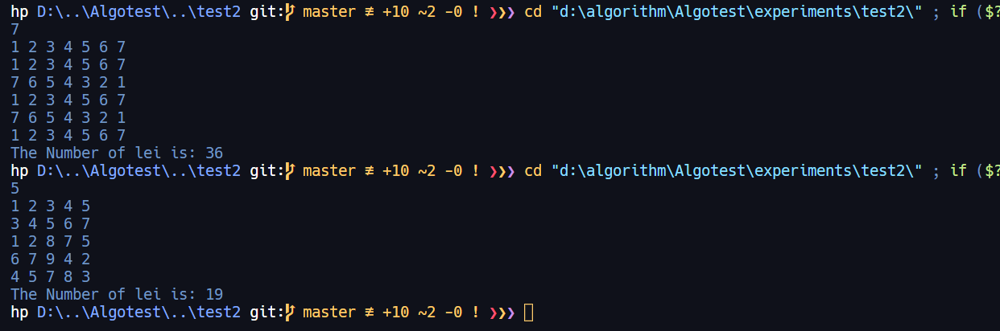
- - -
## USTB地图
+ 这道题先找条件，N条马路N个路口，根据题意可理解成N个点，N条边，则至少有一个环
+ 一般情况下我们不会去说一个路口只连两条马路，这不是正常的路口这最多是个转角，但本题是布置监控，转角处监控肯定要照顾到，所以说种情况算作成立。
+ 考虑动态规划的话能想到的动态方程为
$$C(n)=\begin{cases} 
C(n-1) & {if 节点n和前n-1连通且与n连通的节点有监控} \\ 
C(n-1) + 1 & {else 其他情况}
\end{cases}$$
画图示意如下
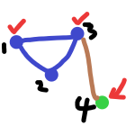
例如这种情况就符合第一个条件，但是如果发生下面这种情况呢？
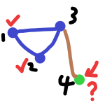
可以看到$C(n-1)=2$，但是选的是$1、3$节点，插入$4$节点后仍要加入一个监控，这显然是错误的，所以说这种方法如果生效必须要知道$min\{C(n-1)\}$的全部集合。下面我们换一种方法
+ 我们学过$Prime$方法求最短路径，能不能根据它的思想求这道题呢？或者说我们怎么去变化这个方法？同样的思路，我们将路口按照连接的马路降序排序，选出一个最大的后就更新剩下的路口连接的马路数量，这显然是可行的方法！

####  __可行性证明：这个方法实际就是证明为什么每次需要选最大的__
+ 首先证明此算法的逻辑正确：
  > 每次选取一条路之后，有`num[ind]--`以及`num[j]--; a[ind][j] = 0; a[j][ind] = 0; a[]`，这保证每次选则一个路口后和这个路口相连的马路断掉,剩下路口更新与之相连的马路信息，所以如果`sum>=n`成立了，一定说明每条路都连接了（即监控已经到位）
+ 为什么选最大的：
  > 我们假设选别的为$m_j$最大为$max$，有$max>m_j>0$选取$m_j$之后其他的与$j$路口连通的任一$m_i$都要进行`num[i]--`，此时$max$仍未全场最大值，因为有$max-1 >= max_2（第二大）$,而此时$sum+num[m_j]<sum+num[max]$也即选取最大的值max,的话sum会最快的等于$n$也就是最早推出循环，也即最终监测点最少。

此题看代码显而易见时间复杂度为$O(n^2)$
以下分别为测试用的三种图及输出结果
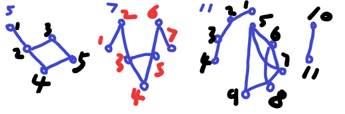
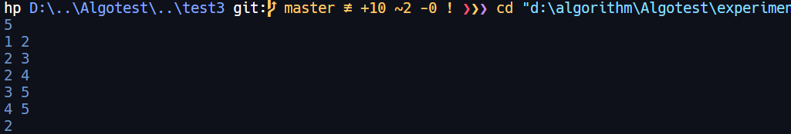
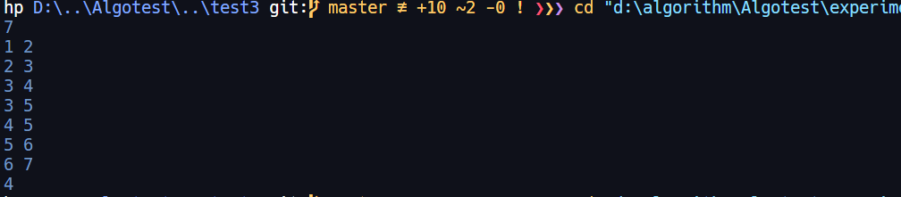
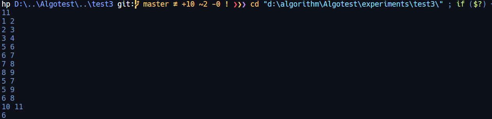
