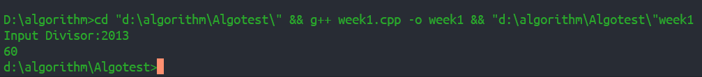
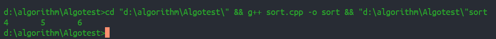

## 被2013整除
**Python代码即截图**
``` Python
n = int(input("Input a Divisor: "))
i = 1;
while int('1' * i) % n:
  i += 1 
print(i)
```
<image src="./python_result.png" width="60%" height="15%">

__C++代码即截图__
``` C++
#include <iostream>
using namespace std;
int main() {
  int n; //除数
  cout << "Input Divisor:";
  cin >> n;
  int div = n % 10;
  while (div != 1 && div != 3 && div != 7 && div != 9)
  {
    cout << "Can't, Input again!";
    cin >> n;
  }
  int num = 1;
  int length = 1;
  while (num % n) {
    length ++;
    num = (num % n) * 10 + 1;
  }
  cout << length;
  return 0;
}
```


- - -
## 伪代码描述欧几里得
``` C++
a , b a < b
while (b!=0) {
  if(a > b)
    a = a-b; //取 a mod b
  else
    b = b-a; //取 b mod a
}
```
- - -
## 查找
给定升序排列的数组A[1] A[2] A[3]......A[n]其元素值两两不相等，找出所有A[i] = i
+ **折半:  O(log(n))**
  + 整数情况
    ``` C++
    L = 1; R = n; mid = (L+R)/2;
    LOOP:
    if A[mid] < 0 && A[mid+1] == 0
      return mid+1;
    if A[mid] > mid
      L = mid
    else R = mid
    ```
    以A[i]-i来看，整数情况下一般分三个部分，左边<0,中间=0,右边>0,二分查找到左边界后向右输出直至 A[index]-index != 0为止。
  + float, double
    ``` C++
    for(A[1] - A[n]) 
      if(A[i] == i) cout << i;
    ```
    小数情况下A[i] = i可出现在多个位置且不定，采用遍历复杂度O(n)
* * *
最终用程序
``` C++
#include <iostream>
using namespace std;
int test2(int b[], int length);
int main() {
  int A[]={-3, -2, -1, 2, 4, 5, 6, 9, 11};
  int length = sizeof(A)/sizeof(int);
  int flag;
  flag = test2(A, length);
  if (flag != -1) {
    while (A[flag] == flag) {
      printf("%d\t", flag);
      flag++;
    }  
  }
  else {
    printf("no!");
  }
  return 0;
}
int test2(int b[], int length) {
  int l = 0, r = length-1, mid;
  while (l <= r) {
    mid = l + r>>1;
    if (mid == 0 && b[mid] == mid) {
      return 0;
    }
    if (b[mid]-mid < 0 && b[mid+1] - mid == 1) {
      return mid+1;
    }
    if (b[mid]-mid >= 0) {
      r = mid-1;
    } 
    else {
      l = mid+1;
    }
  }
  return -1; 
}
```
