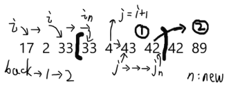
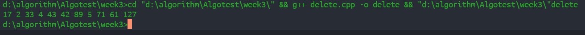
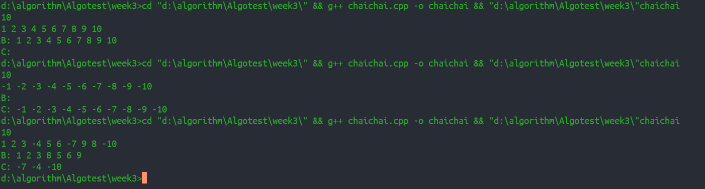
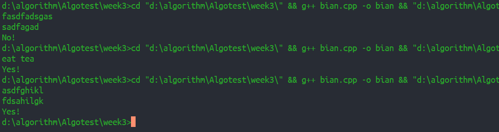
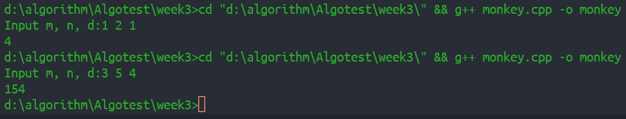
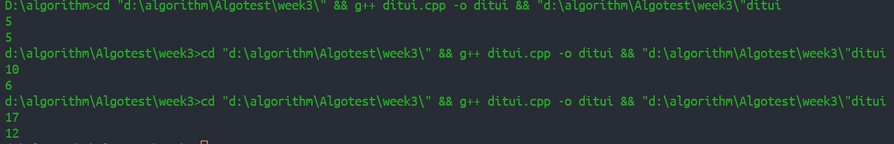
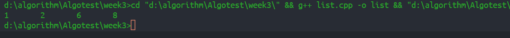

### 1复杂度
``` C
int stery (int n) {
  int S = 0;
  for (int i=1; i<=n; i++) {
    S = S+i*i;
  }
  return S;
}
```
此算法返回1^2^+2^2^+...n^2^和，基本语句为 `S = S+i*i;` 执行了n次，时间复杂度T(n) = O(n)
- - -
### 2复杂度
``` C
m = 0;
for (i=1; i<=n; i++) {        
  for (j=1; j<=2*i; j++) {    
    m=m+1;
  }
}
```
`m=m+1;` 执行了 $\sum_{i=1}^n2i = n(n+1)$ 次，时间复杂度是T(n) = O(n)
- - -
### 3求递推关系式
$$T(n)=\begin{cases}
1 & {n = 1} \\
2T(n/3)+n & {n > 1}
\end{cases}$$

+ T(n)=n+2T(n/3)
  \= n + 2(2T(n/9) + n/3)
  \= n + 2/3n + 4(T(n/27) + n/9)
  \= n + 2/3n + 4/9n + $2^3T(n/3^3)$
  \...
  \= n + 2/3n + 4/9n + ... + 2/3$^{k-2} + 2^{k-1}T(n/3^{k-1})$
  设$n=3^k$则原式变为$T(n)=n(1+2/3+4/9+(2/3)^{k-1})+2^kT(1)=n*3((2/3)^{k-1}-1)+2^{k-1}$
  $=3(2^{k-1}1)+2^{k-1}=2*2^k-3=O(n)$
  + 其中$T(n/3^{k-1})=O(1) $
- - -
### 删除数组中重复元素
+ 首先考虑一下排序数组,根据图像不难判断第一个重复元素到第二个重复元素之间的元素要向前移动一位，第二个重复元素至第三个重复元素之间需向前移动两位如图

如上情况下每个元素移动的位数可以确定因此每个元素只需移动一次最多移动不超过n次
``` C++
#include <iostream>
using namespace std;
int main() {
  int A[16] = {17,2,33,33,4,43,42,42,42,89,89,5,71,61,127,127};
  int back, j, old = 1;
  for (int i=0; i<15; i++) {
    if (A[i+1] == A[i]) {
      while (A[i+1] == A[i]) {
      i++;
      back++;
      }
      for (j = i+1; j<15; j++) {
        if (A[j+1] == A[j])
          break;
      }
      for (int k=i; k<j; k++) {
        A[k-back] = A[k];
      }
      i = j-1;
      }
  }
  for (int m = 0; m < 16-back; m++) {
    cout << A[m] << " ";
  }
  return 0;
}
```
+ 上述示例代码看似由两重for循环，实际上都是对i的一次遍历，整个关键代码意思是先找到第一个重复元素while判断多少重复，也即判断移动`back++`是几位，时候j从i+1开始遍历到第二个重复元素，之后for循环移动i和j之间的元素，接着`i=j-1;`这是因为第一个for循环里还有`i++`，也就是下次i从第二个重复元素开始，这样相当于线性从i遍历到j再`i=j`
<center></center>


- - -
### 拆分表A
+ 就按照A部分为B，右部分为C，我们设置i, j两兄弟从表A的两端出发，i向右走，遇到<0的停下,j向左走遇到>0的停下，交换位置，直到两兄弟相遇,原理画了一下如下图（图右下角改为 >=0 ）
- 快排简化版，算法只需从两端开始近似为遍历一次，故时间复杂度$T(n) = O(n)$
<center></center>

``` C++
#include <iostream>
using namespace std;
int main() {
  int n, i = 0, j;
  cin >> n;
  int A[n];
  for (int k=0; k<n; k++) {
    cin >> A[k];
  }
  j = n-1;
  while (i < j) {
    while (A[i] >= 0 && i < n) {
      i++;
    }
    while (A[j] < 0 && j > 0) {
      j--;
    }
    if (i < j) {
      int t = A[i];
      A[i] = A[j];
      A[j] = t;
      i++;  j--;
    }
  }
  cout << "B: ";
  for (int k = 0; k<i; k++) {
    cout << A[k] << " ";
  }
  cout << '\n' << "C: ";
  for (int k = i; k<n; k++) {
    cout << A[k] << " ";
  }
  return 0;
}
```

- - -
### 变位词
+ 因为是给定的两个单词，都是26个字母组成的，因此我们可以给一个26大小的数组，统计单词中每个字母出现的次数比较一下即可
+ 由上，不管是26个字母还是大小写分开算的52个亦或是全部的ASCII字符，数组都不会很大，所以这种方式适用这几种情况
+ 我们下面的代码就以26个不区分大小写为例
+ 实际就是这个数组统计A中的字母后比如A['a']++,之后比较B中时用A['a']--，最后看A是否全为0
``` C++
#include <iostream>
#include <cstring>
using namespace std;
int main() {
  char A[20], B[20];
  int word[27] = {0};
  cin >> A >> B;
  if (strlen(A) != strlen(B)) 
    cout << "No!";
  else
  {
    for (int i=0; i<strlen(A); i++) {
      word[A[i]-97]++;
      word[B[i]-97]--;  
    }
    for (int i=0; i<26; i++) {
      if (word[i] != 0) {
        word[27] = 1;
      }
    }
    if (word[27] == 1)
      cout << "No!";
    else 
      cout << "Yes!";  
  }
  return 0;
}
```
+ 代码中word[27]时作为判断位使用 :smile:


- - -
### 猴子吃桃
+ 设T(n)为n-1天前拥有的桃子,T(n-1) = T(n)/2 - m（即T(1)为当天拥有,T(2)为一天前） 得到：  
$T(n) = (T(n-1)+m) * 2$ 
由此我们不难直接推出第n天和第一天的关系式，但我们仍然选择用递归解一下这个题
``` C++
#include <iostream>
using namespace std;
int monkey(int day);
int m, n, d;
int main() {
  cout << "Input m, n, d:" ;
  cin >> m >> n >> d;
  int num = monkey(n);
  cout  << num;
  return 0;
}
int monkey(int day) {
  if(day == 1)
   return d;
  else
    return 2 * (monkey(day-1) + m);
}
```


- - -
### 求解双递推摆动数列
  `a[1]=1; a[2i]=a[i]+1; a[2i+1]=a[i]+a[i+1]`
  i为正整数求第n项与前n项的和
- 上式已经给出递归函数只需判断 n的奇偶性即可 即 n&1 == 0偶数
``` C++
#include <iostream>
using namespace std;
int res(int n) {
  if (n == 1)
    return 1;
  else
    return (n&1) == 0? res(n/2)+1 : res(n/2)+res(n/2+1);
}
int main() {
  int n, sum = 0;
  cin >> n; 
  cout << res(n);
  for (int i=0; i<n; i++) {
    sum += res(n);
  }
  return 0;
}
```

- - -
### 单向链表求和
+ 单向链表表示十进制整数，求和问题

+ 这道题题意不是很清楚，因为如果要加的两个整数是用户输入的两个数字，我们完全可以将数字先相加再将相加的结果转为链表，而如果输入（不考虑用户究竟如何输入）为一个链表的情况下我们又不知道此题要求的链表是否可以添加除了值和next指针的其他参数，如果可以，我们可以将链表添加额外参数作为权重，即
$1(4)->2(3)->3(2)->4(1)$  &nbsp;  + &nbsp; $ 2(2)->3(1)$（括号内为权重）
此种情况下显然可以判断权重生成链表，也就是说此题题意不明的情况问题分为多种角度，下面给出输入为两个链表的情况：先将链表转为数字求和，将和化为新的链表
``` C++
#include <iostream>
#include <stdlib.h>
using namespace std;
typedef struct list
{
  int value;
  struct list* next;
}List;
int main() {
  List *A, *B, *p, *q, *t;
  A = (List*)malloc(sizeof(List));  p = A;
  B = (List*)malloc(sizeof(List));  q = B;
  for (int i = 0; i < 4; i++) {
    t = (List*)malloc(sizeof(List));
    t->value = i+1;
    p->next = t;
    p = t;
  }
  p->next = NULL;
  for (int i = 0; i < 2; i++) {
    t = (List*)malloc(sizeof(List));
    t->value = i+3;
    q->next = t;
    q = t;
  }
  q->next = NULL;
  List *head1 = A->next, *head2 = B->next;
  int sum1 = 0, sum2 = 0;
  while (head1) {
    sum1 = sum1 * 10 + head1->value;
    head1 = head1->next;
  }
  while (head2) {
    sum2 = sum2 * 10 + head2->value;
    head2 = head2->next;
  }
```
``` C++
  int sum = sum1+sum2, i = 0;
  int ss[100] = {0};
  while (sum) {
    ss[i] = sum%10;
    sum = sum/10;
    i++;
  }
  List *C, *m;
  C = (List*)malloc(sizeof(List)); m = C;
  for (int k = i-1; k >= 0; k--) {
    t = (List*)malloc(sizeof(List));
    t->value = ss[k];
    m->next = t;
    m = t;
  }
  m->next = NULL;
  List *head = C->next;
  while (head) {
    cout <<head->value <<'\t';
    head = head->next;
  }
  return 0;
}
```

- - -