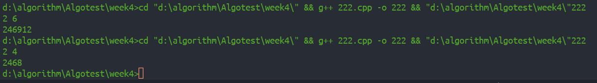
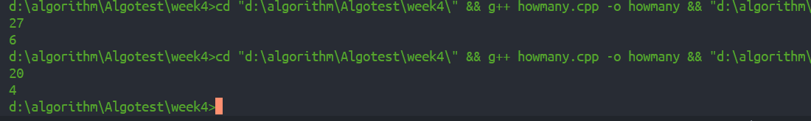
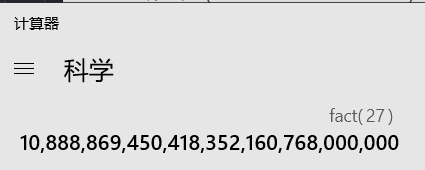
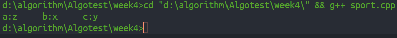
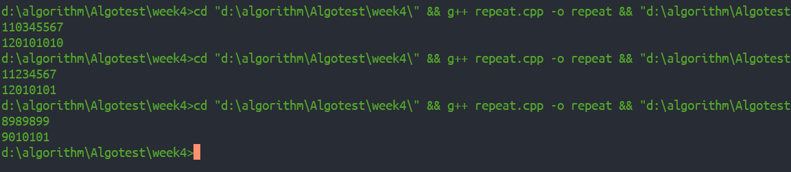
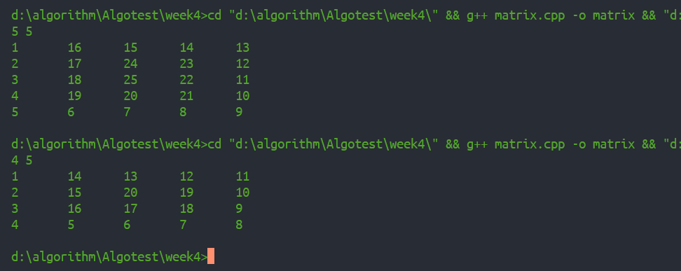
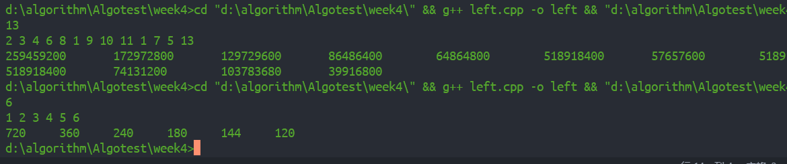

### 求2+22+222+...+22...
+ 首先可以得出规律每一项为前一项*10+2，即$a_{n}=a_{n-1}*10+2$,由此一方面可通过累加令 `a = a*10 + 2`得出结果，这种角度来看的话，如果是给定了最后一项项数，即最后一项有几个2的话会容易解。
+ 还可将其每一项分解可得到另一列有规律的式子以2222为例
2\*1 + 2\*10 + 2\*100 + 2\*1000
2\*1 + 2\*10 + 2\*100
2\*1 + 2\*10
2\*1
`sum = 2*n+2*10*(n-1)+2*100*(n-2)+2*1000*(n-3)`

下面以第二种方式为例解法如下
``` 
#include <iostream>
using namespace std;
int main() {
  int n, m; //n 为基数（2） m为项数
  cin >> n >> m;
  int sum, a=1;
  for (int i=m; i>=1; i--) {
    sum += a*i;
    a = a*10;
  }
  sum += sum;
  cout << sum;
  return 0;
}
```

- - -
### 1\*2\*3*...*n末尾有多少零
+ 很老的题了，零的个数和5直接相关，一步一步看，有多少个0就有多少个10相乘，要得到10一定有5，那么是不是每个5都会对应一个0呢？这是肯定的，因为10=5*2，相邻的两个5和5之间一定有更多的偶数可以分解出2，所以说一个5对应一个0，所以这道题就变成了求有多少个这样的5，举例看一下
n=11有5 10 两个5
n=27有5 10 15 20 25(25 = 5\*5代表两个5)
有6个5(27/5=5 + 27/5/5=1 = 6)
综上0的个数实际是n/5+n/5/5+n/5/5/5...（25贡献两个5 125贡献3个5）
``` 
#include <iostream>
using namespace std;
int main(){
  int n, i = 0;
  cin >> n;
  while (n) {
    i += n/5;
    n = n/5;
  }
  cout << i;
  return 0;
}
```


- - -
### 球队比赛
+ 将x y z对应为1 2 3实际上并没有简化计算，实际发现 a b c（实际上是x y z）完全可以用char类型即`for(a = 'x'; a <= 'z'; a++)`,采用接近遍历的解法，if语句稍微简化了判断过程，跳过无用步骤
``` 
#include <iostream>
using namespace std;
int main() {
  int a, b, c;
  for (a=1; a<=3; a++) {
    for (b=1; b<=3; b++) {
      if (a != b ) {
        for (c=1; c<=3; c++) {
          if (c!=a && c!=b && a!=1 && c!=1 && c!=3) {
            cout << "a:" << char('w' + a) << '\t'
                 << "b:" << char('w' + b) << '\t'
                 << "c:" << char('w' + c) << '\t';
          } 
        }
      }
    }
  }
  return 0;
}
```

- - -
### 不重复数
+ 这个题显然不暴力破解的话就是找规律，求的是最小，显然不论这个书中有多少对重复的，我们肯定要把最高的重复为变不重复，之后地位就可以自己更改成最小的排列方式，例如11035567 要先对11操作变成12这样不论尾巴怎么变肯定比原来结果打，所以对尾巴操作035567就要变成最小的010101，但是这样的话要考虑另一种情况就是99进位，例如899要变成900之后仍是重复的还要变成901，更例如
89899->89900->90000->90101解决也很简单，循环判断一下重复并设置进位即可
``` 
#include <iostream>
#include <cstring>
#include <cmath>
using namespace std;
int compare(int a[], int i) {
  for (int j=i; j>=0 ; j--) {
    if (a[j] == a[j-1]) 
      return j;
  }
  return 0;
}
int compare(int num) {
  int a[10], lenth = 0;
  while (num) {
    a[lenth] = num%10;
    num /= 10;
    lenth++;
  }
  for (int j=lenth; j>=0 ; j--) {
    if (a[j] == a[j-1] && a[j] == 9) 
      return -1;
    else if (a[j] == a[j-1])
      return j;
  }
  return 0;
}
int main() {
  int n, num;
  cin >> n;
  num = n;
  int a[10], lenth = 0;
  while (num) {
    a[lenth] = num%10;
    num /= 10;
    lenth++;
  }
  int flag = compare(a, lenth);
  int flag1 = compare(n);
  while (flag1 == -1) {
    n += pow(10, flag-1);
    flag1 = compare(n);
    num = n;
    lenth = 0;
    while (num) {
      a[lenth] = num%10;
      num /= 10;
      lenth++;
    }
    flag = compare(a, lenth);
  }
  if (flag > 0) {
    n += pow(10, flag-1);
    a[flag-1]++;
    for(int i = flag-2, k = 0; i>=0; i--) {
      a[i] = k;
      k = k^1;
    }
  }
  for (int k=lenth-1; k >=0 ; k--) {
    cout << a[k];
  }
  return 0;
}
```

+ 实际解决中重载了compare函数，参数为n的compare用来处理特殊情况即8989899这种情况，`int flag1 = compare(n);` 返回-1代表遇到了99进位，这时候要更新n，而更新n需要 `int flag = compare(a, lenth);` 它只用来返回重复的是哪一位数字，`n += pow(10, flag-1);` 就是更新进位后的n，只到将特殊情况8989899这种特殊情况更新成90000也就是类似于110345567这种一般情况之后循环数组置010101就行了
- - -
### 构造m行n列逆转矩阵
+ 这个就是螺旋矩阵一层一层矩阵赋值即可，只要看准四个关键点
(0, 0) --> (m-1, 0) --> (m-1, n-1) --> (0, n-1) 之后每层边界都有m--; n--
``` 
#include <iostream>
using namespace std;
int main() {
  int m, n;
  cin >> m >> n;
  int a[m][n];
  int sum = 1, k = 0;
  while (sum <= m*n) {
    int i = k, j = k++;
    if (i > m/2)
      break;
    for (i; i < m-k; i++) {
      a[i][j] = sum++;
    }
    for (j; j < n-k; j++) {
      a[i][j] = sum++;
    }
    for (i; i >= k; i--) {
      a[i][j] = sum++;
    }
    for (j; j >= k; j--) {
      a[i][j] = sum++;
    }
  }
  if ((m*n)%2 == 1) {
    a[m/2][n/2] = m*n;
  }
  for(int k = 0; k < m ; k++) {
    for (int j = 0; j < n ; j++) {
      cout << a[k][j] << '\t';
    }
    cout << endl;
  }
  return 0;
}
```

- - -
### b[i]赋值
+ 这个课件上使用的left[i]和right[i]的方法满足时间复杂度O(n)但不满足空间复杂度O(1)，而题目要求不适用其他任何变量，那就只有在b[i]上操作，推出公式
$b[n-2] = b[n-1]*a_{n-1}/a_{n-2}$
$b[n-2] = b[1]*a_1/a_{n-2}$
但是没有发现有什么用，仍然需要出发，思考b[i]利用两次的方法牺牲b[0]作为原来的left[i]，先使`b[i] = left[i]`,之后再循环一次令b[0]作为right[i]再使`b[i] *= b[0]`即可
``` 
#include <iostream>
using namespace std;
int main() {
  int n;
  cin >> n;
  int a[n], b[n];
  for (int i=0; i<n; i++) {
    cin >> a[i];
  }
  b[0] = 1;
  for (int i = 1; i < n; i++) {
    b[0] *= a[i-1];
    b[i] = b[0];
  }
  b[0] = 1;
  for (int i = n-2; i > 0 ; i--) {
    b[0] *=  a[i+1];
    b[i] *= b[0];
  }
  b[0] *= a[1];
  for (int i = 0; i < n; i++)
  {
    cout << b[i] << '\t';
  }
  
  return 0;
}
```
