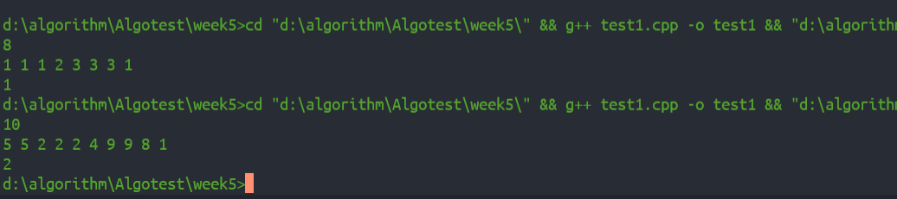
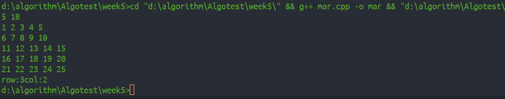
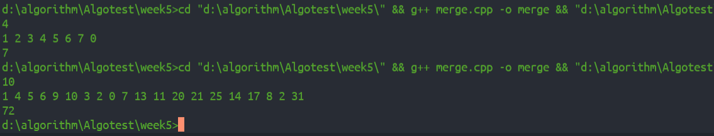

### 寻找众数
+ 这个题首先很同意想到先将其排序后直接遍历就可很容易找到众数，而我们一般采用的快排时间复杂度为$O(N*logN)$，所以再想时间复杂度小于$O(N*logN)$的方法，而$O(N)$复杂度的方法在此题中我是想不出来了，所以直接快排得到。以下最重要的部分即为快排解法。
\#include <iostream>
using namespace std;
int a[100];
int midpart(int low, int hight) {
  int index = a[low];
  int j = low;
  for (int i = low+1; i <= hight; i++) {
    if (a[i] < index) {
      j++;
      if (j != i) {
        int t = a[i];
        a[i] = a[j];
        a[j] = t;
      }
    }
  }
  a[low] = a[j];
  a[j] = index;
  return j;
}
void qsort(int low, int hight) {
  if (hight > low) {
    int pnext = midpart(low, hight);
    qsort(low, pnext-1);
    qsort(pnext+1, hight);
  }
}
int main() {
  int n;
  cin >> n;
  for (int i = 0; i < n; i++)
  {
    cin >> a[i];
  }
  qsort(0, n-1);
  int count = 0, max = 0;
  int index = 0;
  for (int i = 0; i < n-1; i++) {
    if(a[i+1] == a[i]) {
      count++;
      continue;
    }
    else {
      max = max>count? max : count;
      index = max>count?index : i;
      count = 0;
    }
  }
  cout << a[index];
  return 0;
}

- - -
### x是否在矩阵M中
+ 老提了，实际用二分也可以，但是比较麻烦，先说最一般的，这个题关键是要找到排查行列坐标的方向，究竟从哪儿开始找，分析这个矩阵特点，左上角最小，右下角最大，就按一般思路肯定也是从四个角中的一个作为起始坐标的，这四个坐标中我们可以看到，对于左上角(我们同一设起始值为$a_0$其中
$a_0=a[0][0] | a[0][n-1] | a[n-1][0] | a[n-1][n-1]$，如果从左上角为$a_0$则若
$a_0 < x$ 它可能在同一行，也可能在同一列，或者别的地方，我们无法正常选则col++还是row++,同样的右下角也是这样，而如果选左下角，则若$a_0 > x$必不在这一行，如果$a_0 < x$必不在这一列，这样的话比较好根据行列关系择优选出适宜的行或列看代码
\#include <iostream>
using namespace std;
int main() {
  int n, x;
  cin >> n >> x;
  int M[n][n];
  for (int i = 0; i < n; i++) {
    for (int j = 0; j < n; j++) {
      cin >> M[i][j];
    }
  }
  int row = n-1, col = 0;
  while (row >= 0 && col <= n-1) {
    if (M[row][col] == x) {
      cout << "row:" << row << "col:" << col;
      break;
    }
    else if (M[row][col] > x) row--;
    else col++;
  }
  if (row < 0 || col > n-1)
  cout << "No!";
  return 0;
}
+ 从这个代码非常直观的可以看出时间复杂度为$O(n)$，（排除输入的循环:smile:），算法while循环最多执行2n-2次即可确定。

- - -
### 逆序对数
+ 这道题解法还原课件上讲的思想即归并排序，2\*n的数组a代表L和R两个根数组，merge_sort是递归调用，关键处理函数是merge它判断L和R即两个子数组的逆序对数，遍历顺序按照课上讲的是从左至右，实际上从子数组末尾向前遍历仍然可以，这里用的是从左至右遍历，newmar是归并排序所必须的额外数组空间，merge一共三个同级的while循环，看while的条件很好理解，一次并不能全部排完，而剩下的未添加进newmar的必定是有序的。最终时间复杂度如课上所讲为$O(nlogn)$，这种复杂度的证明第一周作业中也联系过，不再赘述。
\#include <iostream>
using namespace std;
int num = 0;
void merge(int a[], int low, int high) {
  int i = low, mid = (low+high)/2, j = mid+1;
  int newmar[high-low+1];
  int ne = 0;
  while (i <= mid && j <= high) {
    if (a[i] < a[j]) {
      newmar[ne++] = a[i++];
    }
    else {
      newmar[ne++] = a[j++];
      num += (mid-i+1);
    }
  }
  while (i <= mid)  newmar[ne++] = a[i++];
  while (j <= high) newmar[ne++] = a[j++];
  for (int i = low; i <= high; i++) {
    a[i] = newmar[i-low];
  }
}
void merge_sort(int a[], int low, int high) {
  if (low < high) {
    merge_sort(a, low, (low+high)/2);
    merge_sort(a, (low+high)/2+1, high);
    merge(a, low, high);
  }
}
int main() {
  int n;
  cin >> n;
  int a[2*n];
  for (int i = 0; i < 2*n-1; i++)
  {
    cin >> a[i];
  }
  merge_sort(a, 0, 2*n-1);
  cout << num;
  return 0;
}
