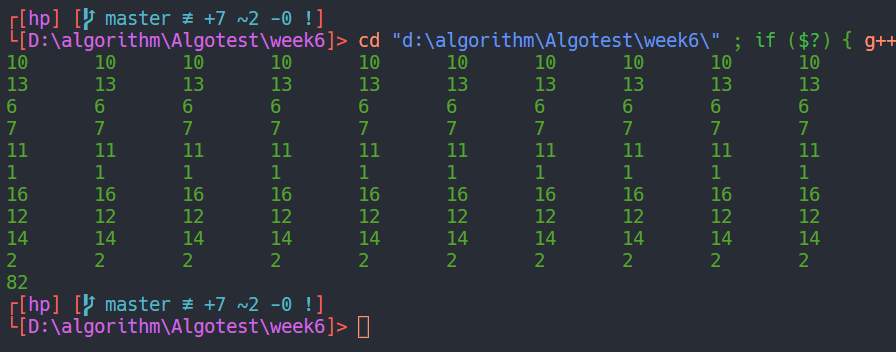
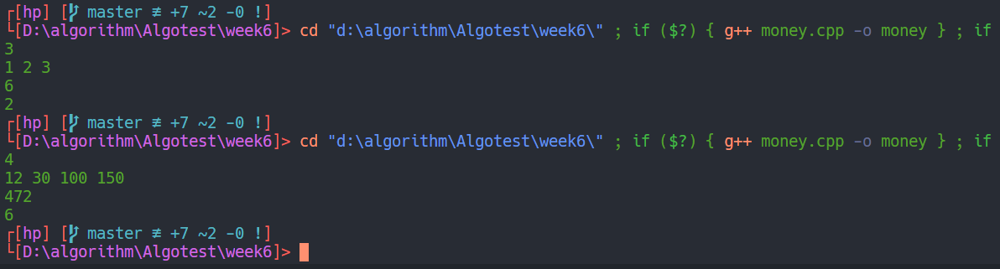
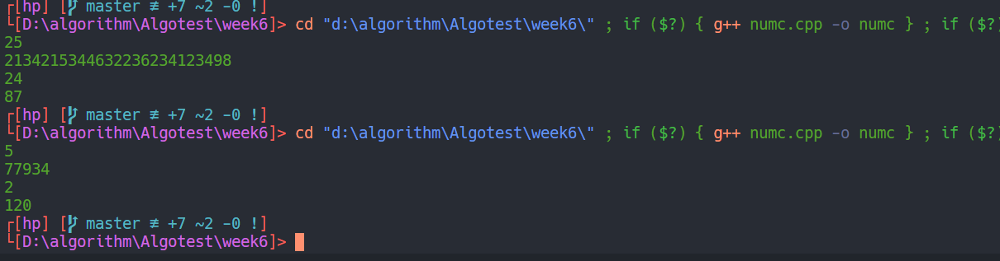

### 数值最小矩阵
+ 一步步倒着更新每一行到下一行的最小值即可，本题考查重点是动态规划，省略数组处理的部分
可以想到转移方程为 `f(row, col) += min(f(row++, col), f(row, col++), f(row++, col++))` ，需要注意的地方是对边界的处理，右下和右下三个方向在这个矩阵中需要处理下边界和右边界，代码如下

- - -
### 货币
① $C(i, j)$ 使，如果$j > S[i]$,则使用$S[i]$这个币值找钱的前提为$j-S[i]$剩下的钱能找的开，此时为 $C(i, j)=C(i, j-S[i])+1$，如果用$S[i]$找不开，则找钱用的就全是$S[i-1]$及之前的币值此时 $C(i, j)=C(i-1, j)$，而又因为$C(i, j)$取的是最小值，所以不管找不着的开，就直接求上面两个的最小值即可，（如果找不开返回一个较大的值即可避免出错）因此最终
$C(i,j)=min(C(i-1,j), C(i,j-S[i]))$   ⚠$j<S[i]$时返回无穷大
②倒推，首先根据上一步中防止找不开的情况，初始化`L[n]={Int_Max}`（实际取到了100000），之后一次开始计算纸币只有S[1]的情况，我们直接举例纸币有12，30，100一共找172元，刚开始初始化一个大数，之后开始只有12元时，如果要找12，24，36，这些能都找开更新L[12|24|36...]=1|2|3...，其他找不开仍未大数，之后还有30的纸币，这时如42就可以更新：42-30剩下的12之前更新了最终L[42]=2;一次循环n（纸币种类）次即可，下面为样例程序

- - -
### 加号数字串
+ 动态规划题还是要找转移方程，首先基本结论有 $k$个数中最多插入$k-1$个加号，所以若是$k$个数中插入$m$个加号一定有$m<=k-1$现在给一个长度为n的数字串，假设插入的$m$的加号中最右边的加号位置为$k$则有 `Min(n, x) = mini(Min(k, x-1) + num(k+1, n))`-`Min(n ,x)`为n个书中插入x个加号，这样一来问题就简单了，接下来处理好`num(k+1, x)`即第$k+1$到第$n$个数字串的大小即可

